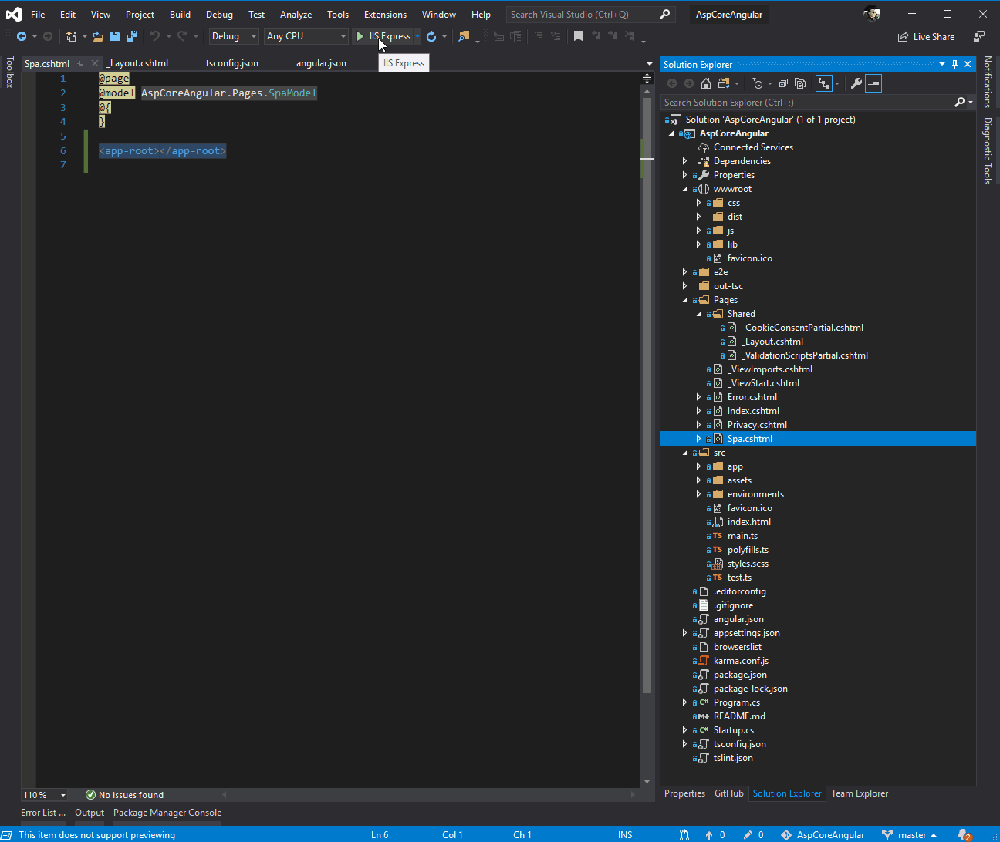

# ASP.NET Core Razor with Angular
Testing grounds for adding an Angular app to an existing ASP.NET Core Razor web application.  

Motivation comes from augmenting an existing ASP.NET Core Razor web application. These are great for getting a web application up and running quickly. However, for the client-side, it relies on jQuery in order to enable some interactive features and also improve the user’s overall experience.
  
jQuery has been played a major role in the development of web applications over the past years, mostly because it supports a consistent syntax across different browsers. The problem is that jQuery code is difficult to test, hard to extend, and most importantly, hard to maintain. Scaling the frontend, maintenance and quality will quickly become a concern.
  
In comes Angular. An opensource JavaScript framework designed for building scalable and dynamic web applications. Angular uses pure HTML as its template language, but allows us to extend HTML’s syntax and combine it with functionality in order to build higher-level components.

Among many things, it supports patterns such as dependency injection (DI) and data binding, which eliminate the need for much of the code we would have to write.
  
## Prerequisites:
- ensure you have node.js installed (https://nodejs.org/en/)
- ensure you have Angular installed (in command prompt run this statement: `npm install -g @angular/cli`)

## Demo of Changes and App
To run this locally, clone this repo, run the `npm install` and `ng build` command from within the project root folder (where the package.json file is located) and then hit F5 from Visual Studio 2019.
  

  
[Click here to view demo with revisions made to newly created web application](aspcore-angular8-demo.gif)

## Notes:
**Src** folder - This is actual source folder of the Angular application, entire project structure is present in this folder.  
**package.json** - file containing the list of NPM packages needed to develop client application.  
**angular.json** - file containing Configuration settings for the Angular application. This file is essential for Angular-CLI to work seamlessly.  
**tsconfig.json** - configuration file must for all TypeScript files to transpile to JavaScript.  
**node_modules** - folder containing all downloaded node modules. This folder is always large, ensure you git ignore this.  
  
## Steps to Re-create:
1. Create a new ASP.NET Core Web Application / Web Application (not MVC, just plain vanilla Web Application using Razor).
2. Navigate out of your project directory and then create your angular app with your project folder name `ng new <your root project folder name>`. This creates the Angular application within the root of the ASP.NET Core project folder.
    - This is to align the package.json and other Angular files with the ASP.NET config files.
3. Update the angular.json file to specify where the Angular build files will be placed:
    ```json
    "options": {
      "outputPath": "./wwwroot/dist",
      ...
    }
    ```
4. Update tsconfig.json to use `include` and `outDir`. The include config entry tells us to compile TypeScript from src folder only instead of entire project structure.
    ```json
    {
    "compileOnSave": false,
    "include": [
      "./src"
    ],
    "compilerOptions": {
      ...
      "outDir": "./wwwroot/dist/out-tsc",
      ...
    }
    ```
5. Update Pages/Shared/_Layout.cshtml  
    Near the top within the `<head>` section add `<base href="/">`

    Near the bottom, just before `@RenderSection("Scripts", required: false)` add your angular scripts:
    ```html
    <script src="~/dist/runtime-es5.js" asp-append-version="true"></script>
    <script src="~/dist/polyfills-es5.js" asp-append-version="true"></script>
    <script src="~/dist/styles-es5.js" asp-append-version="true"></script>
    <script src="~/dist/vendor-es5.js" asp-append-version="true"></script>
    <script src="~/dist/main-es5.js" asp-append-version="true"></script>

    <script src="~/dist/runtime-es2015.js" asp-append-version="true"></script>
    <script src="~/dist/polyfills-es2015.js" asp-append-version="true"></script>
    <script src="~/dist/styles-es2015.js" asp-append-version="true"></script>
    <script src="~/dist/vendor-es2015.js" asp-append-version="true"></script>
    <script src="~/dist/main-es2015.js" asp-append-version="true"></script>
    ```
6. Add a new Razor Page and reference your root angular component in the newly created cshtml with `<app-root></app-root>`. For example:
    ```razor
    @page
    @model AspCoreAngular.Pages.SpaModel
    @{
    }

    <app-root></app-root>
    ```

## Reference
https://www.mithunvp.com/angular-asp-net-mvc-5-angular-cli-visual-studio-2017/
